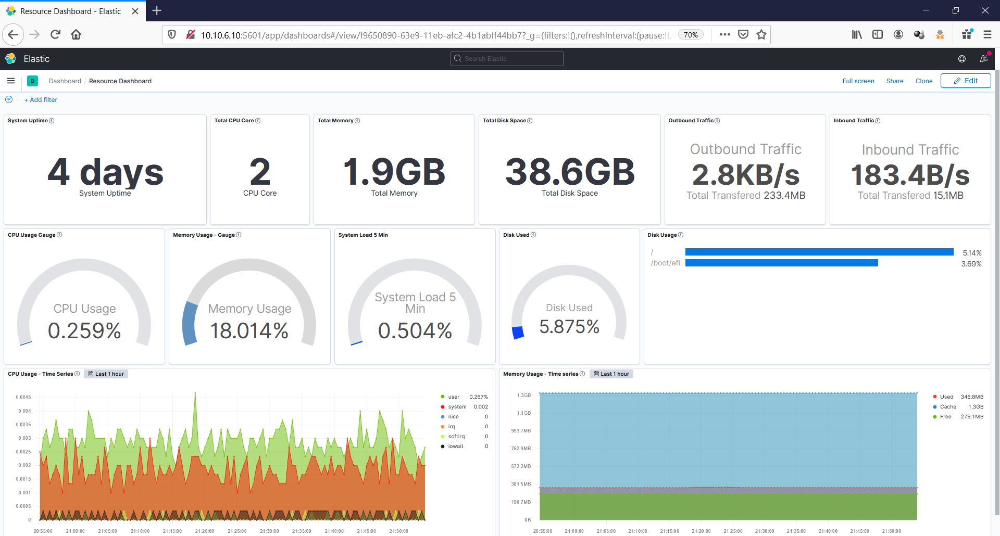

# Membuat Dashboard Kibana

Setelah semua step dilakukan hal terakhir untuk menampilkkan semua data kedalam satu tempat yang sama dengan mengatur tata letak yang diinginkan maka kita dapat melakukannya dengan membuat **Dashboard** pada kibana. 

Tujuan dari **Dashboard** untuk melakukan pengelompokan visualisasi kedalam satu tempat sesuai dengan visual yang ingin ditampilkan.

## 1. Membuat Dashboard Resource Monitoring

Pertama-tama pergi ke menu **Dashboard** untuk melihat daftar dashboard. Apabila sebelumnya berlum ada dashboard maka dapat membuatnya dengan pilih **Create New Dashboard**.

Setelah itu tambahkan visualisasi yang telah dibuat sebelumnya dan susun sehingga visualisasi dapat dengan mudah dilihat dan dianalisis.

Setelah selesai simpan dashboard yang sudah disusun.

## 2. Membuat Dashboard Raw Data

Sama seperti langkah sebelumnya. Pertama-tama pergi ke menu **Dashboard** untuk melihat dan pilih **Create New Dashboard**.

Setelah itu tambahkan visualisasi yang telah dibuat sebelumnya dan susun sehingga visualisasi dapat dengan mudah dilihat dan dianalisis.

Setelah selesai simpan dashboard yang sudah disusun.

# Hasil dari Visualisasi Data

## Resource Monitoring

## Raw Data Dashboard

