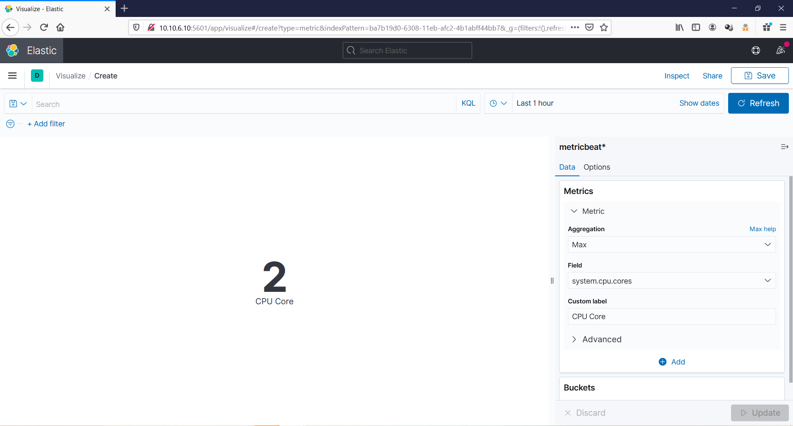
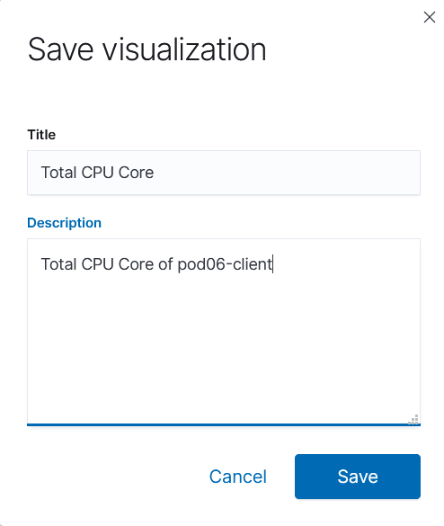
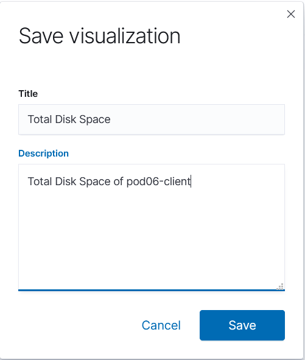
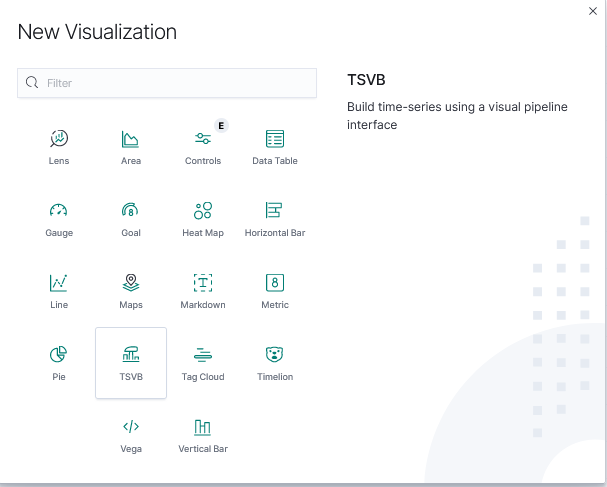
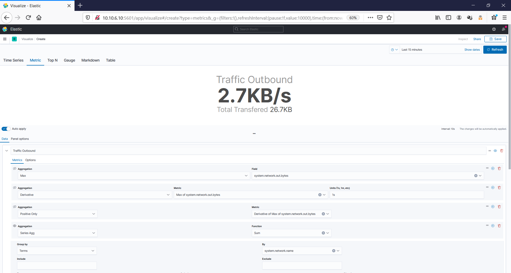

# Membuat Visualisasi Resource Kibana

Setelah melakukan pemasangan dan konfigurasi dari semua package yang diperlukan. Maka langkah selanjutnya adalah membuat index pattern untuk mengakses data elasticsearch yang akan dieksplor.

## 1. Menambahkan Index Pattern
Buka halaman kibana pada browser.
```sh
http://10.10.6.10:5601
```


Setelah halaman kibana terbuka, selanjutnya buka pengaturan **Stack Management** pada menu kibana.


Selanjutnya pilih menu **Index Pattern > Create Index pattern**.


Selanjutnya buat definisi untuk index pattern. Karena terdapat beberapa index dari elasticsearch, maka gunakan asterisk untuk memilih seluruh index terkait dengan metricbeat.


Setelah index pattern selesai dibuat. Cek semua data dengan membuka menu **Discover** pada kibana.


## 2. Membuat visualisasi

Setelah berhasil membuat index pattern selanjutnya membuat visualisasi dari data-data tersebut. Untuk membuat visualisai pergi ke menu **Visualize** pada kibana.

### a. Membuat visualisasi Up Time

Pertama-tama edit field **system.uptime.duration.ms** pada index pattern metricbeat. Tujuan diubahnya yaitu agar data tersebut dapat dibaca dengan mudah saat divisualisasikan. Pertama pergi ke **Stack Management > Index Pattern > metricbeat > Search** lalu search **system.uptime.duration** lalu edit pada field tersebut.

Ubah format pada field tersebut dari format field sebelumnya **Number** mejadi **Duration**.


Setelah mengubah field **system.uptime.duration** selanjutnya pergi ke menu **Visualize**. Lalu buat visualisasi baru.


Setelah itu pilih tipe bentuk visualisasi. Untuk system uptime maka pilih bentuk **Metric** dan pilih sumber data dari **metricbeat**.


Lalu pilih opsi pada metric dengan *aggregation = max* dan pilih field *field = system.uptime.duration*.


Setelah pengaturan selesai, simpan visualisasi tersebut.


### b. Membuat Visualisasi Jumlah Core CPU

Buat visualize baru. Pilih tipe bentuk visualisasi. Untuk melihat total **CPU Cores** maka pilih bentuk **Metric** dan pilih sumber data dari **metricbeat**.


Lalu pilih opsi pada metric dengan *aggregation = max* dan pilih field *field = system.uptime.duration*.



Setelah selesai simpan visualisasi tersebut.



### c. Membuat Visualisasi Total Memory

Pertama-tama edit field **system.memory.total** pada index pattern metricbeat. Tujuan diubahnya yaitu agar data tersebut dapat dibaca dengan mudah saat divisualisasikan. Pertama pergi ke **Stack Management > Index Pattern > metricbeat > Search** lalu search **system.memory.total** lalu edit pada field tersebut.

Ubah format pada field tersebut dari format field sebelumnya **Number** mejadi **Bytes**.


Setelah selesai mengedit simpan perubahan dan pindah ke halaman **Visualize** lalu buat visualize baru dan pilih tipe bentuk visualisasi. Untuk melihat total bytes **memory** maka pilih bentuk **Metric** dan pilih sumber data dari **metricbeat**.


Lalu pilih opsi pada metric dengan *aggregation = Average* dan pilih field *field = system.memory.total*.


Jika sudah selesai simpan visualisasi tersebut/


### d. Membuat Visualisasi Disk Space

Pertama-tama edit field **system.filesystem.total** pada index pattern metricbeat. Tujuan diubahnya yaitu agar data tersebut dapat dibaca dengan mudah saat divisualisasikan. Pertama pergi ke **Stack Management > Index Pattern > metricbeat > Search** lalu search **system.filesystem.total** lalu edit pada field tersebut.

Ubah format pada field tersebut dari format field sebelumnya **Number** mejadi **Bytes**.


Setelah selesai mengedit simpan perubahan dan pindah ke halaman **Visualize** lalu buat visualize baru dan pilih tipe bentuk visualisasi. Untuk melihat total bytes dari **Disk** maka pilih bentuk **Metric** dan pilih sumber data dari **metricbeat**.


Lalu pilih opsi pada metric dengan *aggregation = Max* dan pilih field *field = system.filesystem.total*.


Jika sudah selesai simpan visualisasi tersebut.



### Membuat Visualisasi Outbound Traffic Network

Pertama-tama pergi ke halaman **Visualize** lalu bentuk yang dipilih adalah **TSVB** karena untuk melihat jumlah **bytes/s** dari metric **system.network.out.bytes**



Atur semua pengaturan data seperti pada gambar dibawah ini. Untuk menampilkan metric secara realtime

