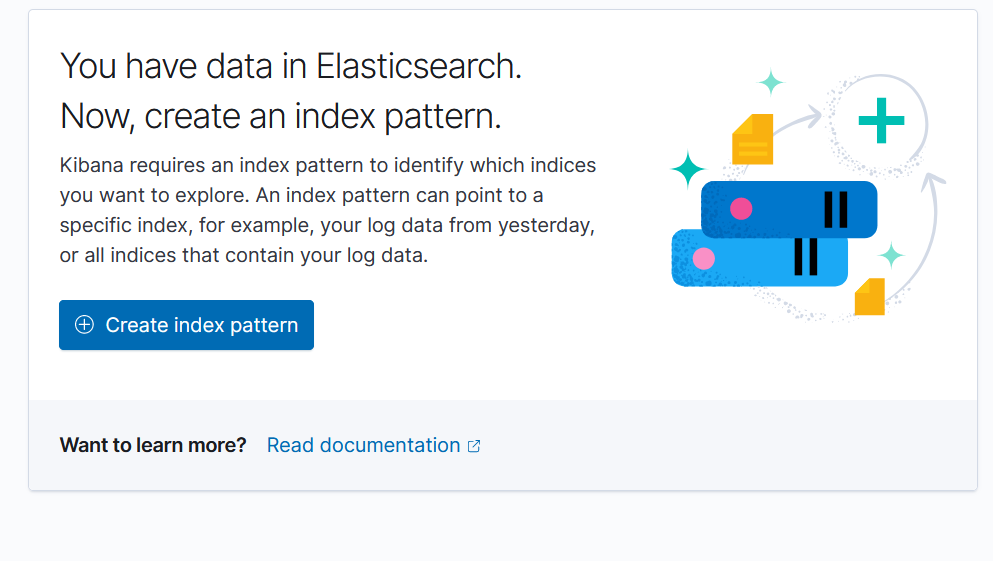
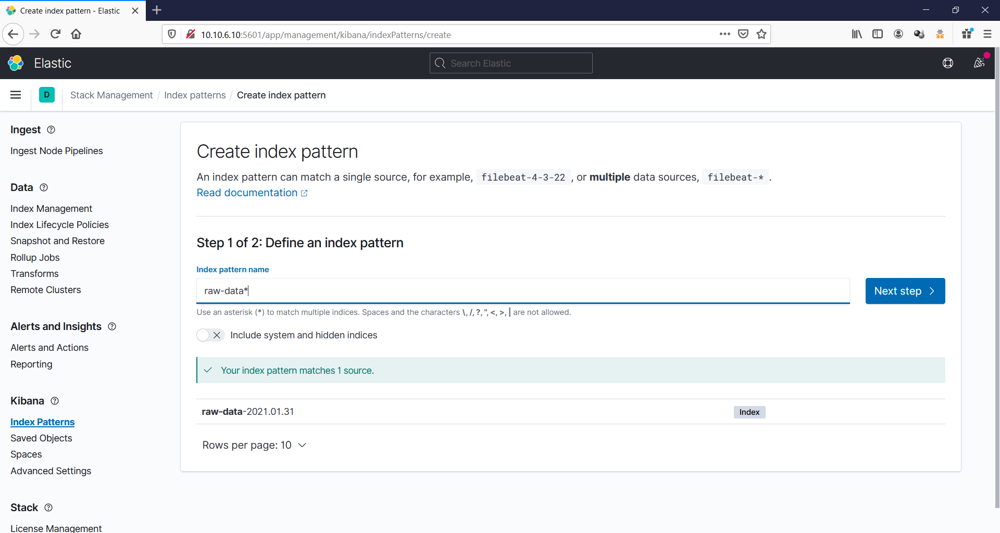
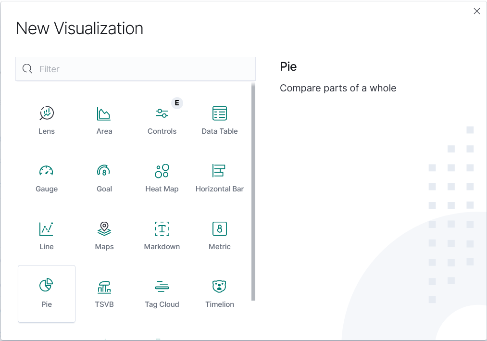
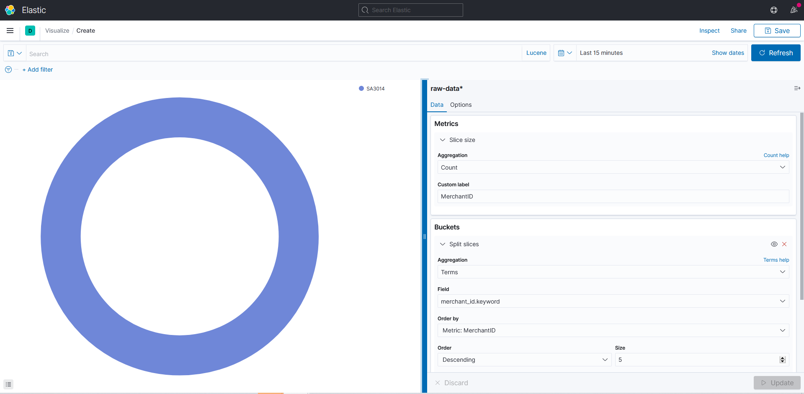
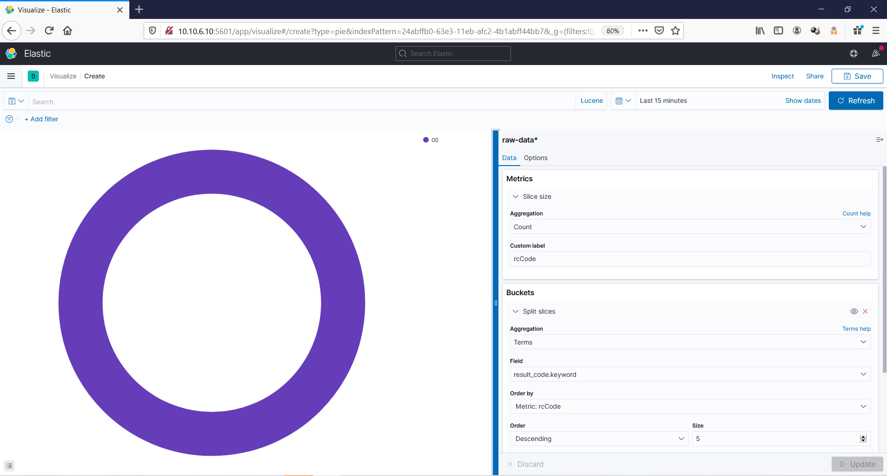
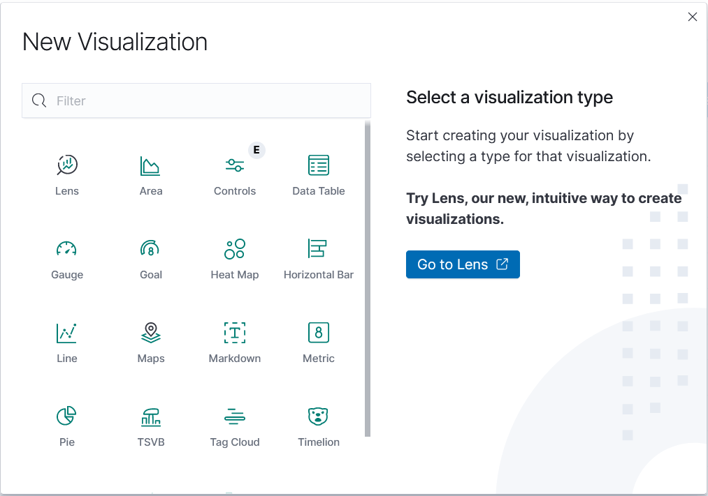
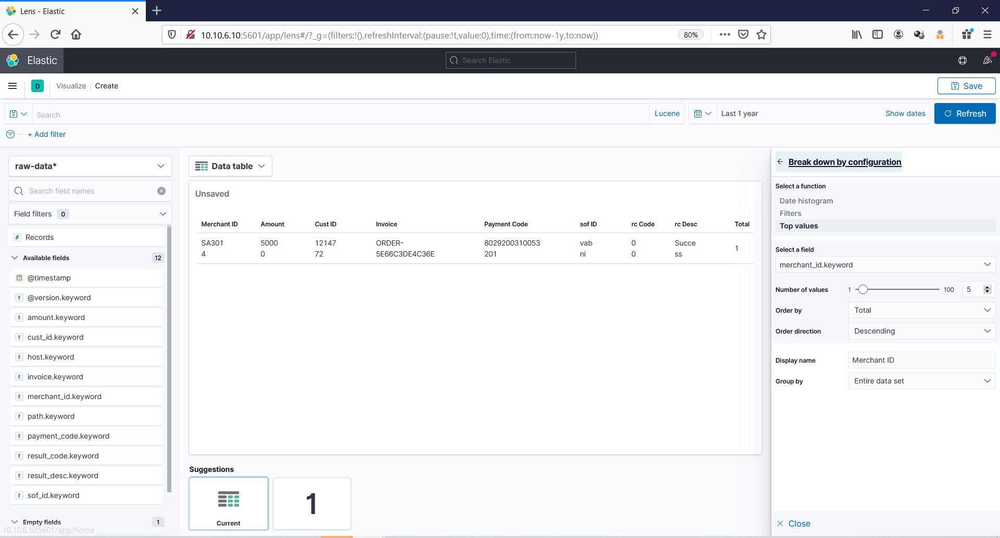

# Membuat Visualisasi Raw Data dalam Kibana

File log atau file yang berisikan kumpulan informasi dapat diolah menjadi data yang terstruktur dan dapat divisualisasikan sehingga data tersebut dapat diolah dan dilakukan analisis. Pada contoh kali ini terdapat sebuah log data yang berisikan riwayat transaksi. Data tersebut terdiri dari banyak field yang berisikan kumpulan data tak terstruktur. Untuk itu kita dapat mengolahnya dan memvisualisasikan data tersebut dalam dashboard Kibana. Yang dibutuhkan untuk mengolah data tersebut, antara lain logstash, elasticsearch, dan kibana.

Logstash disini berguna untuk menerima masukan dari data mentah yang akan diolah. Setelah data diolah logstash akan mengirimkan data tersebut ke elasticsearch untuk disimpan menjadi sebuah index. Lalu kibana berfungsi untuk memvisualisasikan kumpulan data yang telah ter-index tersebut. Berikut langkah-langkah yang dilakukan untuk mengolah data mentah tersebut.

## 1. Menyiapkan dan Memanipulasi Data

Data transaksi yang akan diolah dapat dilihat sebagai berikut:

```sh
05:32:00:23 # REQUEST START
05:32:00:23 # Header : HTTP_HOST = 192.168.136.37 & HTTP_ACCEPT = */* & CONTENT_TYPE = application/json & HTTP_X_FORWARDED_FOR = 182.0.188.12 & HTTP_X_FORWAR
DED_HOST = billhosting.finnet-indonesia.com & HTTP_X_FORWARDED_SERVER = finnet-indonesia.com & HTTP_CONNECTION = Keep-Alive & CONTENT_LENGTH = 620 & PATH = /
sbin:/usr/sbin:/bin:/usr/bin & SERVER_SIGNATURE =  & SERVER_SOFTWARE = Apache & SERVER_NAME = 192.168.136.37 & SERVER_ADDR = 192.168.136.37 & SERVER_PORT = 8
0 & REMOTE_ADDR = 192.168.134.6 & DOCUMENT_ROOT = /var/www/html & SERVER_ADMIN = root@localhost & SCRIPT_FILENAME = /home/prepaidsystem/api/apiFinpay.php & R
EMOTE_PORT = 52561 & GATEWAY_INTERFACE = CGI/1.1 & SERVER_PROTOCOL = HTTP/1.1 & REQUEST_METHOD = POST & QUERY_STRING =  & REQUEST_URI = /prepaidsystem/api/ap
iFinpay.php & SCRIPT_NAME = /prepaidsystem/api/apiFinpay.php & PHP_SELF = /prepaidsystem/api/apiFinpay.php & REQUEST_TIME = 1583793120 &
05:32:00:23 # Incoming Data : {"add_info1":"Arifirmansyah","amount":50000,"cust_email":"ibnuhasanbashri@yahoo.com","cust_id":1214772,"cust_msisdn":"628515619
8343","cust_name":"Arifirmansyah","failed_url":"https:\/\/api.byu.id\/api\/payment\/finnet\/failed","invoice":"ORDER-5E66C3DE4C36E","items":"[[\"Yang Bikin N
agih\",50000,1]]","merchant_id":"SA3014","return_url":"https:\/\/api.byu.id\/api\/payment\/finnet\/return","sof_id":"vabni","sof_type":"pay","success_url":"h
ttps:\/\/api.byu.id\/api\/payment\/finnet\/return","timeout":1440,"trans_date":"20200310053158","mer_signature":"xxxxxxxxxxxxxxxxxxxxxxxxxxxxxx
486CE334770970224AA1"}
05:32:00:23 - add_info1 : Arifirmansyah
05:32:00:23 - amount : 50000
05:32:00:23 - cust_email : ibnuhasanbashri@yahoo.com
05:32:00:23 - cust_id : 1214772
05:32:00:23 - cust_msisdn : 6285156198343
05:32:00:23 - cust_name : Arifirmansyah
05:32:00:23 - failed_url : https://api.byu.id/api/payment/finnet/failed
05:32:00:23 - invoice : ORDER-5E66C3DE4C36E
05:32:00:23 - items : [["Yang Bikin Nagih",50000,1]]
05:32:00:23 - merchant_id : SA3014
05:32:00:23 - return_url : https://api.byu.id/api/payment/finnet/return
05:32:00:23 - sof_id : vabni
05:32:00:23 - sof_type : pay
05:32:00:23 - success_url : https://api.byu.id/api/payment/finnet/return
05:32:00:23 - timeout : 1440
05:32:00:23 - trans_date : 20200310053158
05:32:00:23 - mer_signature : xxxxxxxxxxxxxxxxxxxxxxxxxxxxxx486CE334770970224AA1
05:32:00:24 # Component Signature : xxxxxxxxxxxxxxxxxxxxxxxxxxxxxxHTTPS://API.BYU.ID/API/PAYMENT/FINNET/F
AILED%ORDER-5E66C3DE4C36E%[["YANG BIKIN NAGIH",50000,1]]%SA3014%HTTPS://API.BYU.ID/API/PAYMENT/FINNET/RETURN%VABNI%PAY%HTTPS://API.BYU.ID/API/PAYMENT/FINNET/
RETURN%1440%20200310053158%009SMRTATCK196
05:32:00:24 # Hash Result : xxxxxxxxxxxxxxxxxxxxxxxxxxxxxx486CE334770970224AA1
05:32:00:32 # Req to -> https://billhosting.finnet-indonesia.com/prepaidsystem/009/reqvabni.php is {"data":{"merchant_id":"SA3014","invoice":"ORDER-5E66C3DE4
C36E","amount":"50000","add_info1":"Arifirmansyah","add_info2":null,"add_info3":null,"add_info4":null,"add_info5":null,"trax":"create","description":"","my_v
code":"","payment_type":"c","timeout":"1440","urlCallback":"https:\/\/billhosting.finnet-indonesia.com\/prepaidsystem\/api\/callVaBni.php"},"description":"",
"payment_type":"c","timeout":"1440","urlCallback":"https:\/\/billhosting.finnet-indonesia.com\/prepaidsystem\/api\/callVaBni.php"}
05:32:00:46 # Res from -> https://billhosting.finnet-indonesia.com/prepaidsystem/009/reqvabni.php is {"trax_type":"create","merchant_id":"SA3014","invoice":"ORDER-5E66C3DE4C36E","payment_code":"8029200310053201","result_code":"00","result_desc":"Success","mer_signature":"xxxxxxxxxxxxxxxxxxxxxxxxxxxxxx"}
05:32:00:49 # Outgoing Data : {"status_code":"00","status_desc":"Success","payment_code":"8029200310053201","redirect_url":"https:\/\/mytelkomsel.finnet-indonesia.com\/topup\/howto.php?invoice=ORDER-5E66C3DE4C36E&amount=50000&timeout=1440&payment_code=8029200310053201&sof_id=vabni"}
05:32:00:49 # REQUEST END
==========START (05:34:03:73)==========
05:34:03:74 PAYMENT REALTIME START
05:34:03:74 # Signature Component xxxxxxxxxxxxxxxxxxxxxxxxxxxxxx
05:34:03:74 # Try To Send Data https://api.byu.id/api/payment/finnet/return
05:34:03:74 - merchant_id : SA3014
05:34:03:74 - pay_date : 20200310053306
05:34:03:74 - invoice : ORDER-5E66C3DE4C36E
05:34:03:74 - amount : 50000
05:34:03:74 - sof_id : vabni
05:34:03:74 - sof_type : notif
05:34:03:74 - payment_code : 8029200310053201
05:34:03:74 - ref_no : 931014
05:34:03:74 - result_code : 00
05:34:03:74 - result_desc : Success
05:34:03:74 - add_info1 : Arifirmansyah
05:34:03:74 - add_info2 :
05:34:03:74 - add_info3 :
05:34:03:74 - add_info4 :
05:34:03:74 - add_info5 :
05:34:03:74 - payment_source : 009
05:34:03:74 - mer_signature : xxxxxxxxxxxxxxxxxxxxxxxxxxxxxx
05:34:08:69 # Response from https://api.byu.id/api/payment/finnet/return is {"status":1,"message":"success"}
05:34:08:87 PAYMENT END
TOTAL EXECUTION TIME (5.1337230205536 in s) WITH AVERAGE (5.1337230205536/row/s)
==========END (05:34:08:87)==========
```
Simpan data tersebut kedalam sebuah file.

```sh
$ vi raw.txt
```
Setelah data tersebut tersimpan lakukan manipulasi pada data tersebut dibuat menjadi single line untuk memudahkan filter yang dilakukan nantinya di logstash. Jalankan perintah berikut untuk melakukan wrapping pada data tersebut.

```sh
$ sed ':a; N; s/\n/ /; ta' raw.txt > raw-data.log
$ sudo mv raw-data.log /etc/logstash/
```

Berikut tampilan data yang sudah dimanipulasi menjadi single line.

```sh
05:32:00:23 # REQUEST START 05:32:00:23 # Header : HTTP_HOST = 192.168.136.37 & HTTP_ACCEPT = */* & CONTENT_TYPE = application/json & HTTP_X_FORWARDED_FOR = 182.0.188.12 & HTTP_X_FORWAR DED_HOST = billhosting.finnet-indonesia.com & HTTP_X_FORWARDED_SERVER = finnet-indonesia.com & HTTP_CONNECTION = Keep-Alive & CONTENT_LENGTH = 620 & PATH = / sbin:/usr/sbin:/bin:/usr/bin & SERVER_SIGNATURE =  & SERVER_SOFTWARE = Apache & SERVER_NAME = 192.168.136.37 & SERVER_ADDR = 192.168.136.37 & SERVER_PORT = 8 0 & REMOTE_ADDR = 192.168.134.6 & DOCUMENT_ROOT = /var/www/html & SERVER_ADMIN = root@localhost & SCRIPT_FILENAME = /home/prepaidsystem/api/apiFinpay.php & R EMOTE_PORT = 52561 & GATEWAY_INTERFACE = CGI/1.1 & SERVER_PROTOCOL = HTTP/1.1 & REQUEST_METHOD = POST & QUERY_STRING =  & REQUEST_URI = /prepaidsystem/api/ap iFinpay.php & SCRIPT_NAME = /prepaidsystem/api/apiFinpay.php & PHP_SELF = /prepaidsystem/api/apiFinpay.php & REQUEST_TIME = 1583793120 & 05:32:00:23 # Incoming Data : {"add_info1":"Arifirmansyah","amount":50000,"cust_email":"ibnuhasanbashri@yahoo.com","cust_id":1214772,"cust_msisdn":"628515619 8343","cust_name":"Arifirmansyah","failed_url":"https:\/\/api.byu.id\/api\/payment\/finnet\/failed","invoice":"ORDER-5E66C3DE4C36E","items":"[[\"Yang Bikin N agih\",50000,1]]","merchant_id":"SA3014","return_url":"https:\/\/api.byu.id\/api\/payment\/finnet\/return","sof_id":"vabni","sof_type":"pay","success_url":"h ttps:\/\/api.byu.id\/api\/payment\/finnet\/return","timeout":1440,"trans_date":"20200310053158","mer_signature":"xxxxxxxxxxxxxxxxxxxxxxxxxxxxxx 486CE334770970224AA1"} 05:32:00:23 - add_info1 : Arifirmansyah 05:32:00:23 - amount : 50000 05:32:00:23 - cust_email : ibnuhasanbashri@yahoo.com 05:32:00:23 - cust_id : 1214772 05:32:00:23 - cust_msisdn : 6285156198343 05:32:00:23 - cust_name : Arifirmansyah 05:32:00:23 - failed_url : https://api.byu.id/api/payment/finnet/failed 05:32:00:23 - invoice : ORDER-5E66C3DE4C36E 05:32:00:23 - items : [["Yang Bikin Nagih",50000,1]] 05:32:00:23 - merchant_id : SA3014 05:32:00:23 - return_url : https://api.byu.id/api/payment/finnet/return 05:32:00:23 - sof_id : vabni 05:32:00:23 - sof_type : pay 05:32:00:23 - success_url : https://api.byu.id/api/payment/finnet/return 05:32:00:23 - timeout : 1440 05:32:00:23 - trans_date : 20200310053158 05:32:00:23 - mer_signature : xxxxxxxxxxxxxxxxxxxxxxxxxxxxxx486CE334770970224AA1 05:32:00:24 # Component Signature : xxxxxxxxxxxxxxxxxxxxxxxxxxxxxxHTTPS://API.BYU.ID/API/PAYMENT/FINNET/F AILED%ORDER-5E66C3DE4C36E%[["YANG BIKIN NAGIH",50000,1]]%SA3014%HTTPS://API.BYU.ID/API/PAYMENT/FINNET/RETURN%VABNI%PAY%HTTPS://API.BYU.ID/API/PAYMENT/FINNET/ RETURN%1440%20200310053158%009SMRTATCK196 05:32:00:24 # Hash Result : xxxxxxxxxxxxxxxxxxxxxxxxxxxxxx486CE334770970224AA1 05:32:00:32 # Req to -> https://billhosting.finnet-indonesia.com/prepaidsystem/009/reqvabni.php is {"data":{"merchant_id":"SA3014","invoice":"ORDER-5E66C3DE4 C36E","amount":"50000","add_info1":"Arifirmansyah","add_info2":null,"add_info3":null,"add_info4":null,"add_info5":null,"trax":"create","description":"","my_v code":"","payment_type":"c","timeout":"1440","urlCallback":"https:\/\/billhosting.finnet-indonesia.com\/prepaidsystem\/api\/callVaBni.php"},"description":"", "payment_type":"c","timeout":"1440","urlCallback":"https:\/\/billhosting.finnet-indonesia.com\/prepaidsystem\/api\/callVaBni.php"} 05:32:00:46 # Res from -> https://billhosting.finnet-indonesia.com/prepaidsystem/009/reqvabni.php is {"trax_type":"create","merchant_id":"SA3014","invoice":"ORDER-5E66C3DE4C36E","payment_code":"8029200310053201","result_code":"00","result_desc":"Success","mer_signature":"xxxxxxxxxxxxxxxxxxxxxxxxxxxxxx"} 05:32:00:49 # Outgoing Data : {"status_code":"00","status_desc":"Success","payment_code":"8029200310053201","redirect_url":"https:\/\/mytelkomsel.finnet-indonesia.com\/topup\/howto.php?invoice=ORDER-5E66C3DE4C36E&amount=50000&timeout=1440&payment_code=8029200310053201&sof_id=vabni"} 05:32:00:49 # REQUEST END ==========START (05:34:03:73)========== 05:34:03:74 PAYMENT REALTIME START 05:34:03:74 # Signature Component xxxxxxxxxxxxxxxxxxxxxxxxxxxxxx 05:34:03:74 # Try To Send Data https://api.byu.id/api/payment/finnet/return 05:34:03:74 - merchant_id : SA3014 05:34:03:74 - pay_date : 20200310053306 05:34:03:74 - invoice : ORDER-5E66C3DE4C36E 05:34:03:74 - amount : 50000 05:34:03:74 - sof_id : vabni 05:34:03:74 - sof_type : notif 05:34:03:74 - payment_code : 8029200310053201 05:34:03:74 - ref_no : 931014 05:34:03:74 - result_code : 00 05:34:03:74 - result_desc : Success 05:34:03:74 - add_info1 : Arifirmansyah 05:34:03:74 - add_info2 : 05:34:03:74 - add_info3 : 05:34:03:74 - add_info4 : 05:34:03:74 - add_info5 : 05:34:03:74 - payment_source : 009 05:34:03:74 - mer_signature : xxxxxxxxxxxxxxxxxxxxxxxxxxxxxx 05:34:08:69 # Response from https://api.byu.id/api/payment/finnet/return is {"status":1,"message":"success"} 05:34:08:87 PAYMENT END TOTAL EXECUTION TIME (5.1337230205536 in s) WITH AVERAGE (5.1337230205536/row/s) ==========END (05:34:08:87)==========
```
## 2. Menyiapkan Grok Pattern

Untuk memasukkan data tak terstruktur diatas maka dibutuhkan grok untuk melakukan filter dari inputan yang diberkan. Untuk itu dibutuhkan grok pattern untuk menemukan pola yang terbentuk sehingga data yang dibutuhkan dapat tercapture. Untuk melakukan pengujian grok pattern dapat mencobanya di situs [Grok Debugger](https://grokdebug.herokuapp.com/).

Setelah menentukan field apa saja yang akan dicapture. Berikut pattern grok yang terbentuk.

```sh
%{GREEDYDATA:unwanted}"cust_id":%{NUMBER:cust_id}%{GREEDYDATA:unwanted}merchant_id%{SPACE:remove_space}:%{SPACE:remove_space}%{WORD:merchant_id}%{SPACE:remove_space}%{GREEDYDATA:unwanted}invoice%{SPACE:remove_space}:%{SPACE:remove_space}%{USERNAME:invoice}%{GREEDYDATA:unwanted}amount%{SPACE:remove_space}:%{SPACE:remove_space}%{NUMBER:amount}%{GREEDYDATA:unwanted}sof_id%{SPACE:remove_space}:%{SPACE:remove_space}%{WORD:sof_id}%{GREEDYDATA:unwanted}payment_code%{SPACE:remove_space}:%{SPACE:remove_space}%{NUMBER:payment_code}%{GREEDYDATA:unwanted}result_code%{SPACE:remove_space}:%{SPACE:remove_space}%{NUMBER:result_code}%{GREEDYDATA:unwanted}result_desc%{SPACE:remove_space}:%{SPACE:remove_space}%{WORD:result_desc}%{GREEDYDATA:unwanted}
```
Setelah itu berikut hasil filter yang didapatkan bila menggunakan pattern diatas untuk mengolah data sebelumnya.

```sh
{
  "unwanted": [
    "05:32:00:23 # REQUEST START 05:32:00:23 # Header : HTTP_HOST = 192.168.136.37 & HTTP_ACCEPT = */* & CONTENT_TYPE = application/json & HTTP_X_FORWARDED_FOR = 182.0.188.12 & HTTP_X_FORWAR DED_HOST = billhosting.finnet-indonesia.com & HTTP_X_FORWARDED_SERVER = finnet-indonesia.com & HTTP_CONNECTION = Keep-Alive & CONTENT_LENGTH = 620 & PATH = / sbin:/usr/sbin:/bin:/usr/bin & SERVER_SIGNATURE =  & SERVER_SOFTWARE = Apache & SERVER_NAME = 192.168.136.37 & SERVER_ADDR = 192.168.136.37 & SERVER_PORT = 8 0 & REMOTE_ADDR = 192.168.134.6 & DOCUMENT_ROOT = /var/www/html & SERVER_ADMIN = root@localhost & SCRIPT_FILENAME = /home/prepaidsystem/api/apiFinpay.php & R EMOTE_PORT = 52561 & GATEWAY_INTERFACE = CGI/1.1 & SERVER_PROTOCOL = HTTP/1.1 & REQUEST_METHOD = POST & QUERY_STRING =  & REQUEST_URI = /prepaidsystem/api/ap iFinpay.php & SCRIPT_NAME = /prepaidsystem/api/apiFinpay.php & PHP_SELF = /prepaidsystem/api/apiFinpay.php & REQUEST_TIME = 1583793120 & 05:32:00:23 # Incoming Data : {"add_info1":"Arifirmansyah","amount":50000,"cust_email":"ibnuhasanbashri@yahoo.com",",
    ","cust_msisdn":"628515619 8343","cust_name":"Arifirmansyah","failed_url":"https:\\/\\/api.byu.id\\/api\\/payment\\/finnet\\/failed","invoice":"ORDER-5E66C3DE4C36E","items":"[[\\"Yang Bikin N agih\\",50000,1]]","merchant_id":"SA3014","return_url":"https:\\/\\/api.byu.id\\/api\\/payment\\/finnet\\/return","sof_id":"vabni","sof_type":"pay","success_url":"h ttps:\\/\\/api.byu.id\\/api\\/payment\\/finnet\\/return","timeout":1440,"trans_date":"20200310053158","mer_signature":"xxxxxxxxxxxxxxxxxxxxxxxxxxxxxx 486CE334770970224AA1"} 05:32:00:23 - add_info1 : Arifirmansyah 05:32:00:23 - amount : 50000 05:32:00:23 - cust_email : ibnuhasanbashri@yahoo.com 05:32:00:23 - cust_id : 1214772 05:32:00:23 - cust_msisdn : 6285156198343 05:32:00:23 - cust_name : Arifirmansyah 05:32:00:23 - failed_url : https://api.byu.id/api/payment/finnet/failed 05:32:00:23 - invoice : ORDER-5E66C3DE4C36E 05:32:00:23 - items : [["Yang Bikin Nagih",50000,1]] 05:32:00:23 - merchant_id : SA3014 05:32:00:23 - return_url : https://api.byu.id/api/payment/finnet/return 05:32:00:23 - sof_id : vabni 05:32:00:23 - sof_type : pay 05:32:00:23 - success_url : https://api.byu.id/api/payment/finnet/return 05:32:00:23 - timeout : 1440 05:32:00:23 - trans_date : 20200310053158 05:32:00:23 - mer_signature : xxxxxxxxxxxxxxxxxxxxxxxxxxxxxx486CE334770970224AA1 05:32:00:24 # Component Signature : xxxxxxxxxxxxxxxxxxxxxxxxxxxxxxHTTPS://API.BYU.ID/API/PAYMENT/FINNET/F AILED%ORDER-5E66C3DE4C36E%[["YANG BIKIN NAGIH",50000,1]]%SA3014%HTTPS://API.BYU.ID/API/PAYMENT/FINNET/RETURN%VABNI%PAY%HTTPS://API.BYU.ID/API/PAYMENT/FINNET/ RETURN%1440%20200310053158%009SMRTATCK196 05:32:00:24 # Hash Result : xxxxxxxxxxxxxxxxxxxxxxxxxxxxxx486CE334770970224AA1 05:32:00:32 # Req to -> https://billhosting.finnet-indonesia.com/prepaidsystem/009/reqvabni.php is {"data":{"merchant_id":"SA3014","invoice":"ORDER-5E66C3DE4 C36E","amount":"50000","add_info1":"Arifirmansyah","add_info2":null,"add_info3":null,"add_info4":null,"add_info5":null,"trax":"create","description":"","my_v code":"","payment_type":"c","timeout":"1440","urlCallback":"https:\\/\\/billhosting.finnet-indonesia.com\\/prepaidsystem\\/api\\/callVaBni.php"},"description":"", "payment_type":"c","timeout":"1440","urlCallback":"https:\\/\\/billhosting.finnet-indonesia.com\\/prepaidsystem\\/api\\/callVaBni.php"} 05:32:00:46 # Res from -> https://billhosting.finnet-indonesia.com/prepaidsystem/009/reqvabni.php is {"trax_type":"create","merchant_id":"SA3014","invoice":"ORDER-5E66C3DE4C36E","payment_code":"8029200310053201","result_code":"00","result_desc":"Success","mer_signature":"xxxxxxxxxxxxxxxxxxxxxxxxxxxxxx"} 05:32:00:49 # Outgoing Data : {"status_code":"00","status_desc":"Success","payment_code":"8029200310053201","redirect_url":"https:\\/\\/mytelkomsel.finnet-indonesia.com\\/topup\\/howto.php?invoice=ORDER-5E66C3DE4C36E&amount=50000&timeout=1440&payment_code=8029200310053201&sof_id=vabni"} 05:32:00:49 # REQUEST END ==========START (05:34:03:73)========== 05:34:03:74 PAYMENT REALTIME START 05:34:03:74 # Signature Component xxxxxxxxxxxxxxxxxxxxxxxxxxxxxx 05:34:03:74 # Try To Send Data https://api.byu.id/api/payment/finnet/return 05:34:03:74 - ",
    "05:34:03:74 - pay_date : 20200310053306 05:34:03:74 - ",
    " 05:34:03:74 - ",
    " 05:34:03:74 - ",
    " 05:34:03:74 - sof_type : notif 05:34:03:74 - ",
    " 05:34:03:74 - ref_no : 931014 05:34:03:74 - ",
    " 05:34:03:74 - ",
    " 05:34:03:74 - add_info1 : Arifirmansyah 05:34:03:74 - add_info2 : 05:34:03:74 - add_info3 : 05:34:03:74 - add_info4 : 05:34:03:74 - add_info5 : 05:34:03:74 - payment_source : 009 05:34:03:74 - mer_signature : xxxxxxxxxxxxxxxxxxxxxxxxxxxxxx 05:34:08:69 # Response from https://api.byu.id/api/payment/finnet/return is {"status":1,"message":"success"} 05:34:08:87 PAYMENT END TOTAL EXECUTION TIME (5.1337230205536 in s) WITH AVERAGE (5.1337230205536/row/s) ==========END (05:34:08:87)=========="
  ],
  "cust_id": [
    "1214772"
  ],
  "remove_space": [
    " ",
    " ",
    " ",
    " ",
    " ",
    " ",
    " ",
    " ",
    " ",
    " ",
    " ",
    " ",
    " ",
    " ",
    " "
  ],
  "merchant_id": [
    "SA3014"
  ],
  "invoice": [
    "ORDER-5E66C3DE4C36E"
  ],
  "amount": [
    "50000"
  ],
  "sof_id": [
    "vabni"
  ],
  "payment_code": [
    "8029200310053201"
  ],
  "result_code": [
    "00"
  ],
  "result_desc": [
    "Success"
  ]
}
```

Field yang tercapture diatas terdapat beberapa field yang tidak diperlukan seperti **%{SPACE}** dan **%{GREEDYDATA}** maka dari itu kedua pola tersebut akan dimasukkan kedalam field **remove_space** dan **unwanted** yang akan didrop ketika diolah oleh logstash.

## 3. Membuat Konfigurasi Logstash

Buat konfigurasi logstash untuk menjalankan proses pengolahan data dari data mentah diatas untuk diolah dan dikirim ke elasticsearch. Jalankan perintah berikut untuk membuat file konfigurasi logstash.

```sh
$ sudo vi /etc/logstash/conf.d/logstash-raw-data.conf
```
Lalu berikut isi dari konfigurasi logstash diatas.

```sh
input {
  file {
   path => "/etc/logstash/raw-data.log"
   start_position => "beginning"
   sincedb_path => "/dev/null"
  }
}
  filter {
   grok {
    match => { "message" => '%{GREEDYDATA:unwanted}"cust_id":%{NUMBER:cust_id}%{GREEDYDATA:unwanted}merchant_id%{SPACE:remove_space}:%{SPACE:remove_space}%{WORD:merchant_id}%{SPACE:remove_space}%{GREEDYDATA:unwanted}invoice%{SPACE:remove_space}:%{SPACE:remove_space}%{USERNAME:invoice}%{GREEDYDATA:unwanted}amount%{SPACE:remove_space}:%{SPACE:remove_space}%{NUMBER:amount}%{GREEDYDATA:unwanted}sof_id%{SPACE:remove_space}:%{SPACE:remove_space}%{WORD:sof_id}%{GREEDYDATA:unwanted}payment_code%{SPACE:remove_space}:%{SPACE:remove_space}%{NUMBER:payment_code}%{GREEDYDATA:unwanted}result_code%{SPACE:remove_space}:%{SPACE:remove_space}%{NUMBER:result_code}%{GREEDYDATA:unwanted}result_desc%{SPACE:remove_space}:%{SPACE:remove_space}%{WORD:result_desc}%{GREEDYDATA:unwanted}' }
  }
   mutate { remove_field => ['unwanted','remove_space'] }
}
output {
  elasticsearch {
   hosts => "http://10.10.6.10:9200"
   index => "raw-data-%{+yyyy.MM.dd}"
}

stdout {}

}
```
Setelah konfigurasi selesai dibuat. Selanjutnya restart service logstash agar logstash memproses konfigurasi diatas.

```sh
$ sudo systemctl restart logstash
```
## 4. Menambahkan Index Pattern di Kibana

Setelah logstash berhasil mengolah data dan mengirim data hasil olahannya ke elasticsearch, maka langkah selanjutnya adalah membuat index pattern di Kibana.

Pergi ke menu **Stack Management > (Kibana) Index Pattern**.





Buat index pattern untuk index data **raw-data**.

Setelah index pattern berhasil dibuat langkah selanjutnya adalah membuat visualisasinya. Sebelum itu apabila ingin mengecek data yang masuk dapat pergi ke menu **Discover** untuk melihat data yang tercapture kedalam elasticsearch.

## 5. Membuat Visualisasi

Setelah berhasil membuat index pattern selanjutnya membuat visualisasi dari data-data tersebut. Untuk membuat visualisai pergi ke menu **Visualize** pada kibana.

### a. Membuat Visualisasi Merchant ID Pie

Pilih menu **Create New Visualization** pada tab **Visualize**. Setelah itu pilih tipe visualisasi yang akan dibuat. Kali ini akan menggunakan tipe pie untuk menampilkan data Merchant ID.



Selanjutnya buat pie chart dengan memilih field **merchant_id**.



Setelah selesai mengatur konfigurasi visualisasi tersebut simpan visualisasi tersebut.

### b. Membuat Visualisasi rc Code Pie

Sama seperti membuat visualisasi sebelumnya. Pilih menu **Create New Visualization** pada tab **Visualize**. Setelah itu pilih tipe visualisasi yang akan dibuat. Pilih tipe pie untuk menampilkan data rc Code.


Selanjutnya buat pie chart dengan memilih field **result_code**.



### c. Membuat Visualisasi Data Table

Untuk membuat Data Table dapat menggunakan Kibana Lens agar memudahkan menambahkan dan mengatur baris dan kolom dari data yang akan ditampilkan. Pilih menu **Create New Visualization** pada tab **Visualize**. Setelah itu pilih **Go to Lens**.



Setelah itu pilih tipe chart yang akan digunakan, yaitu **Data Table** . Lakukan drag & drop field kedalam chart untuk membuat visualisasi tersebut. Atur **Display Name** pada tiap field agar disesuaikan dengan tampilan kolom yang akan ditampilkan.



Setelah selesai membuat visualisasi diatas kemudian simpan visualisasi tersebut.

[< Langkah Sebelumya](https://github.com/bagaswibowo25/elk-lab/blob/master/Metricbeat.md) &nbsp;&nbsp;&nbsp;&nbsp;&nbsp;&nbsp;&nbsp;&nbsp;&nbsp;&nbsp; [Langkah Selanjutnya >](https://github.com/bagaswibowo25/elk-lab/blob/master/Dashboard.md)